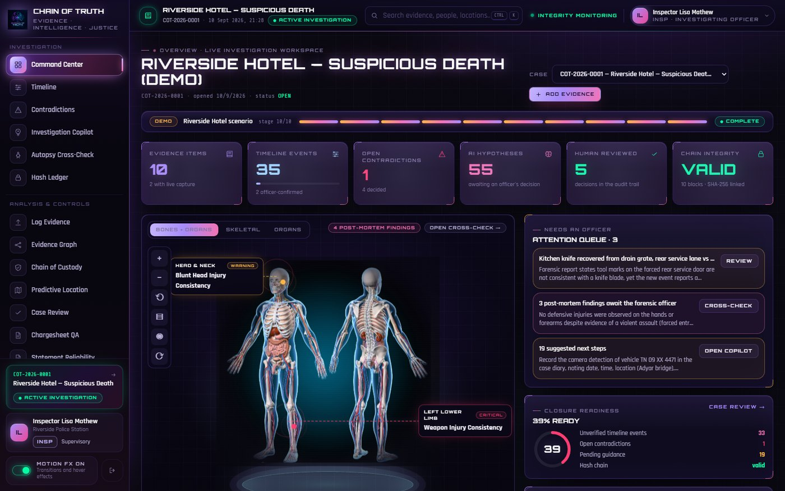
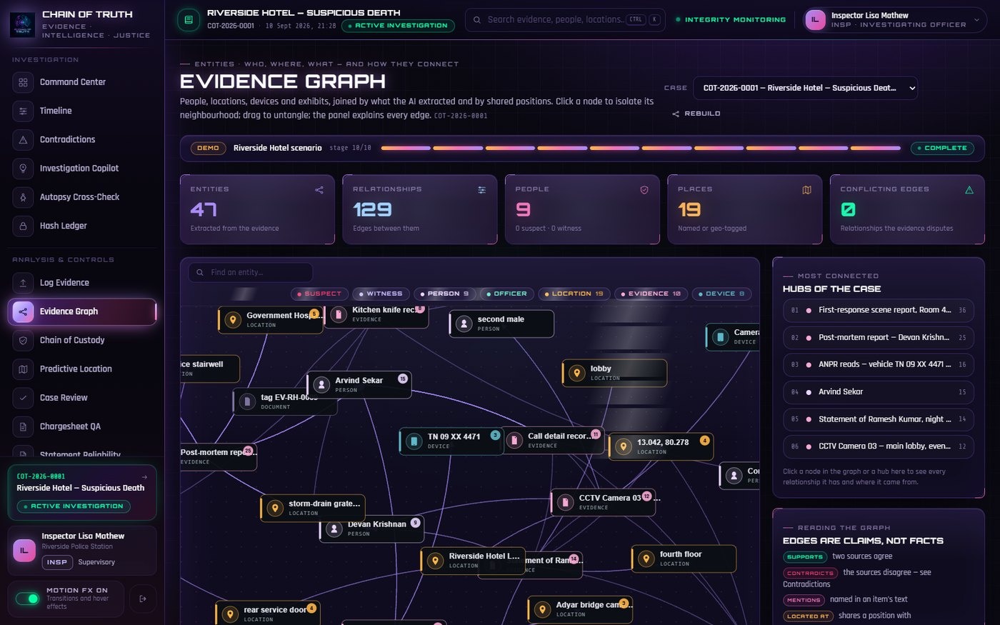
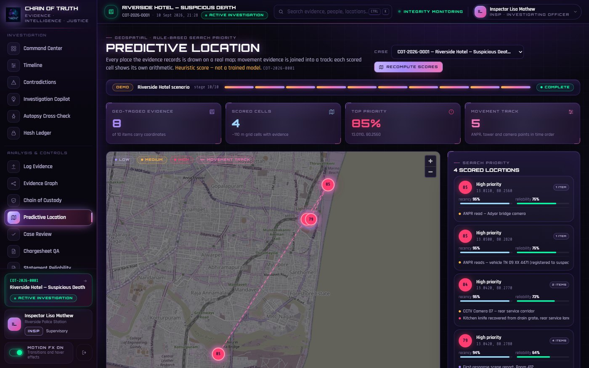
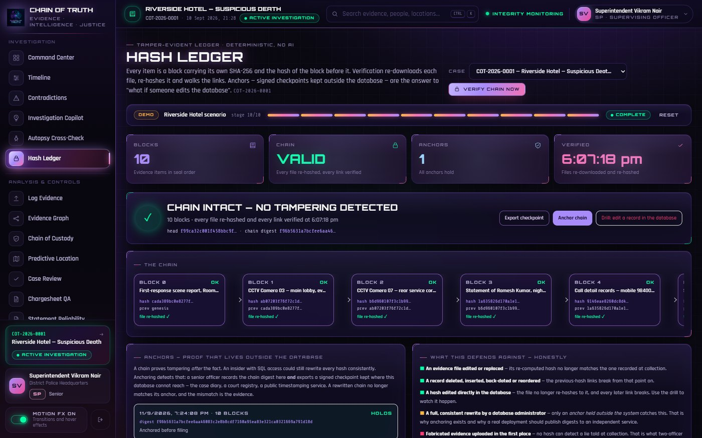
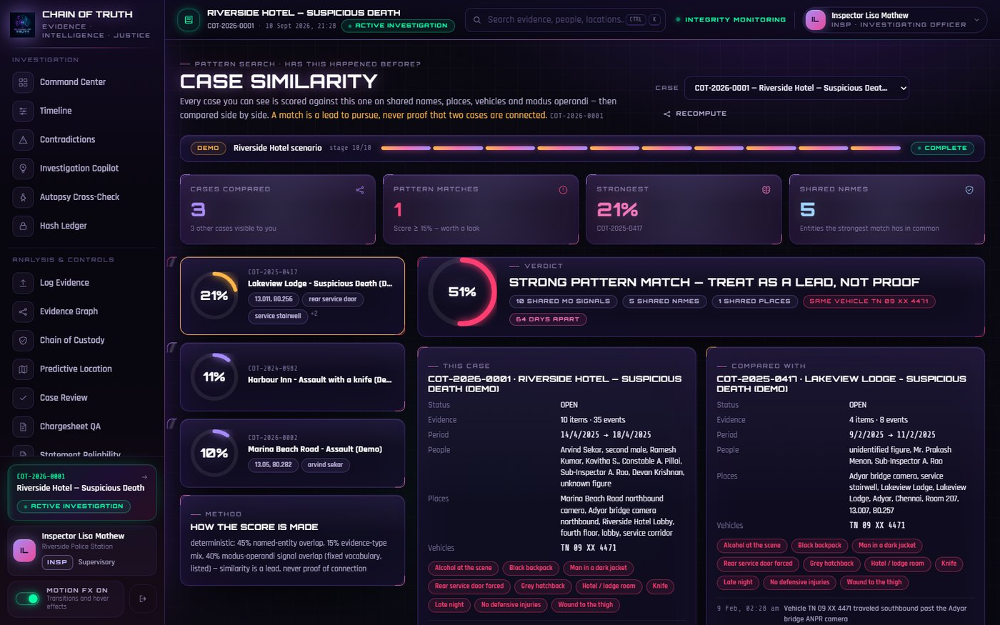

# Chain of Truth

**AI-assisted evidence integrity & investigation system for police and the judiciary.**

> AI assists investigators — it does not determine guilt. Every AI output is a hypothesis until an officer confirms it, and every confirmation is logged.

**Presentation:** [`docs/Chain_of_Truth_Deck.pptx`](docs/Chain_of_Truth_Deck.pptx) · **Demo video:** <https://youtu.be/w0_ygtt7hr0>



| | |
|---|---|
|  Evidence graph |  Predictive location |
|  Hash ledger |  Case similarity |

All ten pages: [`docs/screenshots/`](docs/screenshots/)

---

## Contents

1. [What it does](#1-what-it-does)
2. [Prerequisites](#2-prerequisites)
3. [First-time setup](#3-first-time-setup) (do once)
4. [Running it every day](#4-running-it-every-day)
5. [Sign in — the demo accounts](#5-sign-in--the-demo-accounts)
6. [The demo case, step by step](#6-the-demo-case-step-by-step)
7. [Every page, explained](#7-every-page-explained)
8. [How authority works (rank + role)](#8-how-authority-works-rank--role)
9. [The hash chain — and "what if someone edits the database?"](#9-the-hash-chain--and-what-if-someone-edits-the-database)
10. [Tests](#10-tests)
11. [Troubleshooting](#11-troubleshooting)
12. [Deployment](#12-deployment)
13. [Project structure](#13-project-structure)
14. [Security notes & known limitations](#14-security-notes--known-limitations)
15. [License](#15-license)

---

## 1. What it does

| Module | What happens |
|---|---|
| **Evidence intake** | Every item is SHA-256 hashed the moment it lands and chained to the previous item. Physical evidence needs a second officer; field ranks (Constable → ASI) must add a live camera capture proving presence. |
| **Chain of custody** | Every touch of an exhibit — collection, witness confirmation, hashing, AI processing, transfer to the lab, senior review — is a custody event stamped with the hash the item carried at that moment. |
| **Timeline** | AI reads each item and lays every dated event on one chronology, marked *unverified* until an officer confirms it. |
| **Contradictions** | Sources are compared against each other (a statement against a camera, a phone against a witness). Each clash is shown side by side with a severity and confidence; an officer decides. |
| **Investigation Copilot** | Procedural next steps citing the BNSS / BSA section they rest on, plus a question box that answers only from the evidence in *this* case, cites it, and admits when the file has no answer. |
| **Autopsy cross-check** | Post-mortem findings pinned on an anatomical figure (bones + organs / bones / organs layers) and checked against what the rest of the file says about the same part of the body. |
| **Hash ledger** | The chain as blocks. Every file is re-downloaded and re-hashed; every link walked. Senior officers anchor the chain outside the database; a tamper drill shows the chain catching an edit. |
| **Evidence graph** | People, places, devices and exhibits joined by what the AI extracted and by shared positions. |
| **Predictive location** | Every geo-tagged item on a real map, movement evidence joined into a track, and a transparent rule-based search-priority score per cell (not a trained model). |
| **Statement reliability** | Every version of every statement is kept; a word-level diff shows exactly what moved between tellings — words, times, names. |
| **Chargesheet QA** | Each claim in a draft is checked against the verified timeline: pass / warning / conflict / unsupported. |
| **Case similarity** | Every other case scored against this one on shared names, places, vehicles and modus operandi, then compared side by side — "has this happened before?" Always a lead, never proof. |
| **Case review** | One honest closure-readiness number with the arithmetic behind it and a link to whatever clears each penalty. |
| **Offline sync** | Field devices queue captures with the timestamp and hash written at capture; the queue reconciles on reconnection. |
| **Audit trail · Personnel** | Every action by every officer with their rank at the time; accounts provisioned strictly top-down. |

---

## 2. Prerequisites

Install these once and check each with the command shown.

| Software | Version | Check |
|---|---|---|
| Git | any recent | `git --version` |
| Python | 3.11 or newer | `python --version` |
| Node.js | 20 LTS or newer (comes with npm) | `node -v` |
| Docker Desktop | current, **running** | `docker --version` |
| Microsoft Edge or Chrome | for the browser tests only | — |

An AI API key is optional — see step 3.2.

---

## 3. First-time setup

Do these once, in order. Every command block says which folder to be in.

### 3.1 Get the code

```powershell
git clone https://github.com/lisamehta0791/AI-Truth-Chain.git
cd AI-Truth-Chain
```

### 3.2 Create the `.env` file (project root)

```powershell
copy .env.example .env
```

Open `.env` and set:

| Setting | What to put |
|---|---|
| `POSTGRES_PASSWORD` | any password for the local database |
| `DATABASE_URL` | the **same** password inside the URL (`postgresql+psycopg://chain_of_truth:<password>@localhost:5433/chain_of_truth`) |
| `JWT_SECRET_KEY` | a long random string — generate one with `python -c "import secrets; print(secrets.token_urlsafe(48))"` |
| `GROQ_API_KEY` | your Groq key (`AI_PROVIDER=groq` is the default). Leave it blank to run without AI: evidence still hashes, chains and logs; the AI stages are skipped and the UI says so. |

Everything else can stay as it is. `.env` is git-ignored and must never be committed.

### 3.3 Start the database and object store (project root)

```powershell
docker compose up -d
docker compose ps
```

You should see `cot_db` (healthy) and `cot_minio` (running). Postgres is published on host port **5433** on purpose — 5432 is very often taken by a PostgreSQL installed natively on Windows.

### 3.4 Backend — create the environment and the database schema

```powershell
cd backend
python -m venv .venv
.venv\Scripts\Activate.ps1
pip install -e ".[dev]"
alembic upgrade head
```

If PowerShell refuses to run `Activate.ps1`, run once: `Set-ExecutionPolicy -Scope CurrentUser RemoteSigned`.

### 3.5 Seed the demo officers, the demo case and the legal knowledge base

Still inside `backend` with the venv active:

```powershell
python ..\scripts\seed_demo_case.py
python ..\scripts\seed_legal_kb.py
```

Add `--scenario` to the first command to also load the whole demo case through the AI pipeline right now (about 8 minutes, needs the Groq key). You can also do that later from inside the app with one click — see section 6.

### 3.6 Frontend — install packages

New terminal, from the project root:

```powershell
cd frontend
npm install
```

Setup is complete.

---

## 4. Running it every day

Two terminals, both opened at the project root.

**Terminal 1 — backend**

```powershell
cd backend
.venv\Scripts\Activate.ps1
uvicorn app.main:app --reload --port 8000
```

`--reload` restarts the server whenever backend code changes, so it never serves stale code.
Check: <http://localhost:8000/docs> shows the API; <http://localhost:8000/health> returns `{"status":"ok"}`.

**Terminal 2 — frontend**

```powershell
cd frontend
npm run dev
```

Open <http://localhost:5173>.

Docker must be running (`docker compose up -d` from the project root if the containers are stopped — they usually stay up between reboots).

> Optional shortcut: `.\scripts\dev.ps1` (from the project root) does all of the above in one go — starts Docker, applies migrations, seeds if needed, stops anything stale on ports 8000 / 5173, and opens the two terminals for you. `.\scripts\dev.ps1 -Scenario` also loads the demo case.

---

## 5. Sign in — the demo accounts

All demo accounts use the password **`DemoPass!2026`** and the domain `@demo.chainoftruth.example`. The login page lists them — click one to sign in.

| Email | Rank | What they can do |
|---|---|---|
| `rajesh.menon@…` | Commissioner | Sees every case. Provisions Superintendents and below. Drives the demo. |
| `vikram.nair@…` | Superintendent | Sees every case. Provisions Inspectors and below. Anchors the ledger. Drives the demo. |
| `meera.iyer@…` | DSP, forensic reviewer | Confirms post-mortem findings. Drives the demo. |
| `lisa.mathew@…` | Inspector (officer of record) | Confirms AI findings, reads the audit trail. |
| `ananya.rao@…` | Sub-Inspector | Confirms or dismisses AI findings. |
| `arjun.pillai@…` | Constable | Logs evidence — a live camera capture is required. |
| `sameer.kulkarni@…` | Public prosecutor (view-only) | Reads everything at Superintendent clearance, changes nothing. |

All officers, cases, victims and evidence are fictional.

---

## 6. The demo case, step by step

The seeded case **COT-2026-0001 — Riverside Hotel, Suspicious Death** starts empty. A **Demo strip** sits at the top of every case page; officers of DSP rank or above see its buttons:

- **Load full demo** — runs all ten stages (about 8 minutes: each item goes through the *real* pipeline — hashed, chained, stored, read by the AI, checked for contradictions; nothing is pre-computed).
- **Next stage** — one stage at a time, for presenting live.
- **Reset** — empties the case again.

The ten stages:

| # | Stage | What appears |
|---|---|---|
| 1 | Scene attended | The first scene report, logged by a Constable with a live capture. |
| 2 | CCTV pulled | Lobby and rear-door camera exports. Timeline events. |
| 3 | Witness statement | The receptionist says the man left at 21:15 — CCTV has him leaving at 20:47. **First contradiction, live.** |
| 4 | Call records | The suspect's phone stays on the hotel's tower long after CCTV shows him gone. |
| 5 | Forensics + seized knife | Lab report; the knife logged with a second officer; custody trail to the FSL and back. |
| 6 | Post-mortem | Findings pinned on the figure; the time-of-death window clashes with the CCTV exit. |
| 7 | Vehicle movements | ANPR reads on the map; movement track; location surface scored. |
| 8 | Follow-up interview | The receptionist changes his timing — Statement reliability shows the diff. |
| 9 | Pre-filing review | Draft chargesheet checked claim by claim (two traps caught), closure readiness scored, a field tablet's offline queue synced, the chain anchored. |
| 10 | Pattern search | Three earlier cases with the same signature — a hotel guest, a knife, a forced rear service door, a grey hatchback — loaded as their own files. Case similarity finds the pattern. |

A good live walk-through after loading: Command Center → Timeline → Contradictions (confirm one) → Autopsy cross-check → Hash ledger (run the tamper drill, then restore) → Case similarity (compare Riverside with Lakeview Lodge) → Case review. Then sign in as the Constable to see the live-capture requirement, and as the prosecutor to see a view-only account.

---

## 7. Every page, explained

| Page | Route | Notes |
|---|---|---|
| Command Center | `/dashboard` | The overview: counts, the figure, what needs an officer, closure readiness, a door into every module. |
| Timeline | `/timeline` | Day-grouped chronology; filters; confirm buttons for SI and above. |
| Contradictions | `/contradictions` | Evidence A vs evidence B, severity, the AI's explanation; confirm / dismiss with a note. |
| Investigation Copilot | `/guidance` | Suggested next steps with their legal reference, plus the grounded question box. |
| Autopsy cross-check | `/autopsy` | Figure with Bones + organs / Skeletal / Organs layers, markers, callouts, heat map, AI mapping sequence. |
| Hash ledger | `/ledger` | Blocks, re-hash verification, anchors, tamper drill, checkpoint export. |
| Log evidence | `/evidence/ingest` | Four-step intake: file → details → live capture (field ranks) → witness & seal. |
| Evidence graph | `/evidence/graph` | Drag, zoom, filter by type, search; click a node for its relationships. |
| Chain of custody | `/chain-of-custody` | The chain in seal order and the selected item's full trail. |
| Predictive location | `/location` | Real map, markers, movement track, scored cells with their arithmetic. |
| Case review | `/closure-score` | Readiness gauge and penalties, each linking to the page that clears it. |
| Chargesheet QA | `/chargesheet` | Existing checks on load; paste a draft to run a new check. |
| Statement reliability | `/statements` | Versions, word-level diff, times and names that changed. |
| Case similarity | `/case-similarity` | Ranked matches and a side-by-side comparison of two cases. |
| Offline sync | `/offline-sync` | Device queues; queue a capture to see the original hash survive the sync. |
| Audit trail | `/audit` | Inspector and above. Every action, filterable. |
| Personnel & access | `/personnel` | Roster by rank; provisioning for DSP and above. |

The active case is chosen once (any page's **Case** selector) and shared by every page.

---

## 8. How authority works (rank + role)

Two independent axes: **role** is what you do on a case (investigating officer, supervisor, forensic reviewer, legal reviewer); **rank** is how senior you are (Constable → Head Constable → ASI → SI → Inspector → DSP → SP → DIG → IG → Commissioner → DGP).

| Capability | Minimum rank |
|---|---|
| Log evidence without a live capture | Sub-Inspector (ranks below must supply one) |
| Confirm or dismiss an AI finding | Sub-Inspector |
| View victim / witness PII | Sub-Inspector |
| Read the audit trail | Inspector |
| Provision and deactivate accounts | Deputy Superintendent |
| Drive the demo scenario | Deputy Superintendent |
| Anchor the hash chain | Deputy Superintendent |
| View every case, not only your own | Superintendent |

Accounts are created **top-down** — you may only create a rank strictly below your own, and the creator is recorded on every account. **View-only** accounts (a prosecutor, an auditor) read at their clearance and cannot write anything.

The interface hides what you cannot use, but that is a courtesy: every rule is enforced again on the server (`backend/app/core/permissions.py`), and `tests/api_rank_permissions.py` tries to break them.

---

## 9. The hash chain — and "what if someone edits the database?"

Every evidence item carries its own SHA-256 and the hash of the item before it. The ledger verifies the chain two ways: every **file** is re-downloaded and re-hashed against the hash recorded at collection, and every **link** is walked. That catches an altered file, an edited hash, and a deleted, inserted or reordered record.

What a chain cannot catch on its own is an administrator rewriting *every* hash consistently. That is what **anchoring** is for: a senior officer records the chain digest and exports a signed checkpoint to be kept outside the system — case diary, court registry, a public timestamping service. A rewritten chain no longer reproduces its anchor, and the mismatch is the evidence.

The ledger page has a presenter's **drill**: it edits one stored hash exactly as an insider with SQL access would; the chain immediately reports the block and the reason, the anchor shows as violated, and *Restore* undoes it. Ledger verification is deterministic cryptography — no AI is involved.

---

## 10. Tests

They run against the live, seeded stack — start it first (section 4). From the project root:

```powershell
backend\.venv\Scripts\python.exe tests\api_smoke.py              # every GET endpoint returns 200
backend\.venv\Scripts\python.exe tests\api_rank_permissions.py   # rank ladder, provisioning, escalation refused
backend\.venv\Scripts\python.exe tests\api_evidence_rules.py     # live-capture gate, view-only enforcement
```

Browser suite (needs Edge or Chrome):

```powershell
npm install playwright-core      # once, at the project root
node tests\e2e_browser.js        # every page as three ranks; fails on any console error
```

All tests honour `API_URL` / `APP_URL` if the stack runs on other ports.

---

## 11. Troubleshooting

**A page looks empty, or a feature "isn't there".**
The backend you are running is older than the code on disk. Stop it (Ctrl+C in Terminal 1) and start it again with `--reload` as in section 4, or run `.\scripts\dev.ps1`, which stops anything stale on ports 8000 / 5173 first.

**`connection refused` on migrations or seeding.**
Docker isn't running or the container isn't up: `docker compose up -d` from the project root, then `docker compose ps` — `cot_db` must show `0.0.0.0:5433->5432/tcp`.

**`password authentication failed` or `database "chain_of_truth" does not exist`.**
You are talking to a *different* PostgreSQL — usually one installed natively on Windows, listening on 5432. This project deliberately uses **5433**; check `DATABASE_URL` ends in `localhost:5433/chain_of_truth` and that its password equals `POSTGRES_PASSWORD`.

**Changed the database password but the old one still works.**
`POSTGRES_PASSWORD` only applies when the data volume is first created. Start over (deletes local data): `docker compose down -v` then `docker compose up -d`, `alembic upgrade head` and the seed scripts again.

**`.\scripts\dev.ps1` says "not recognized".**
You are inside `backend` or `frontend`. The script lives at the project root — `cd ..` first, or call it by full path.

**`Activate.ps1 cannot be loaded because running scripts is disabled`.**
`Set-ExecutionPolicy -Scope CurrentUser RemoteSigned` once, then try again.

**No contradictions, no timeline events after loading evidence.**
The AI key is blank or invalid, so the AI stages were skipped (the UI shows *AI skipped*). Set `GROQ_API_KEY` in `.env` and restart the backend. Hashing, custody, the ledger, location scoring and similarity work without a key.

**The map is blank.**
Tiles come from OpenStreetMap over the internet — check connectivity. Street names appear from zoom 13 upwards.

**CORS error in the browser console.**
The frontend is running on a port the backend does not allow. `cors_origins` in `backend/app/config.py` allows `http://localhost:5173`; add any other port you use.

**The interface animates too much / too little.**
Use the **Motion FX** switch at the bottom of the sidebar. Motion is on by default regardless of the operating-system "reduce motion" setting.

---

## 12. Deployment

```powershell
docker compose -f docker-compose.yml -f docker-compose.prod.yml up -d --build
```

Builds and runs the full stack (Postgres, MinIO, backend, frontend) in containers using the same `.env`. Rotate `JWT_SECRET_KEY` and every API key first. Known limit: the WebSocket manager is in-process, so run a single backend replica unless you add a Redis pub/sub layer.

---

## 13. Project structure

```
.env.example                 every setting, documented — copy to .env
docker-compose.yml           Postgres (pgvector, port 5433) + MinIO for local development
docker-compose.prod.yml      adds the backend and frontend containers for deployment
database/init_pgvector.sql   enables pgvector when the database is first created
backend/
  app/api/v1/                one router per module (evidence, timeline, contradictions, ledger, copilot, demo …)
  app/services/              the logic: hashing + chain, AI pipeline, ledger, similarity, location scoring …
  app/services/ai/           the LLM adapters (Groq / Anthropic) and the extraction prompts
  app/demo/                  the Riverside scenario, the related cases, the synthetic illustrations
  app/core/permissions.py    every rank / role rule, enforced server-side
  alembic/versions/          database migrations — this IS the schema
frontend/
  src/pages/                 one page per module
  src/components/anatomy/    the figure viewer (your reference imagery in public/anatomy/)
  src/components/ui/         the shared kit: Panel, StatTile, Tabs, Button, Chip, CountUp …
  src/components/demo/       the Demo strip
  src/components/layout/     shell, navigation, page transition
scripts/
  seed_demo_case.py          officers + demo case (--scenario loads all ten stages)
  seed_legal_kb.py           the legal knowledge base the copilot cites
  verify_hash_chain.py       independent chain verification from the command line
  dev.ps1                    optional one-command start
tests/                       API and browser tests against the live stack
docs/                        the presentation deck and ten screenshots
```

---

## 14. Security notes & known limitations

- No secrets are hard-coded; everything sensitive comes from `.env`, which is git-ignored. `backend/app/config.py` refuses to start with the placeholder JWT secret.
- Every permission rule is enforced on the server, never only in the interface.
- For production, lock the audit log at the database level: `REVOKE UPDATE, DELETE ON audit_log FROM <app role>;`
- The WebSocket manager is in-process (single replica).
- Offline sync is a real queue with real hashes, but queued captures are not yet replayed through the full evidence pipeline automatically.
- The anatomical figure is reference imagery for marking findings — not a medical-grade model of the deceased.
- The legal knowledge base is illustrative placeholder content, not verified legal citations.
- Similarity and location scores are transparent heuristics — leads to pursue, never proof.

---

## 15. License

Released under the [MIT License](LICENSE).

> Provided "as is", without warranty of any kind. Chain of Truth is a decision-support tool: **AI assists, humans decide.** No output of this system is a legal determination, and nothing here substitutes for review by a qualified investigating officer, forensic medical officer or public prosecutor.
